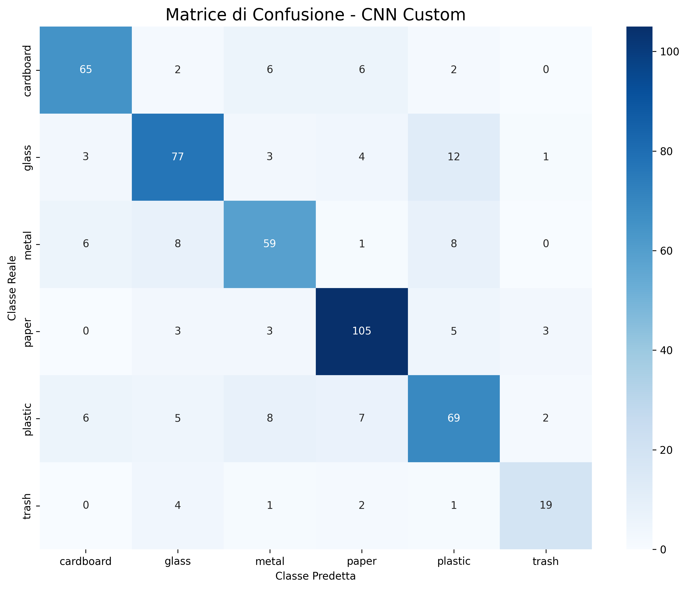
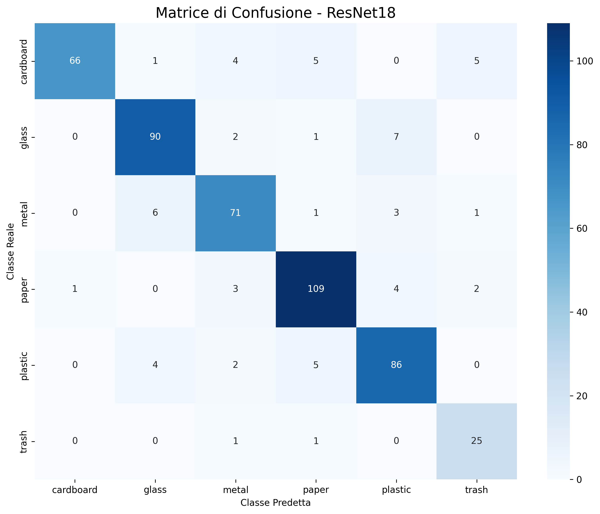
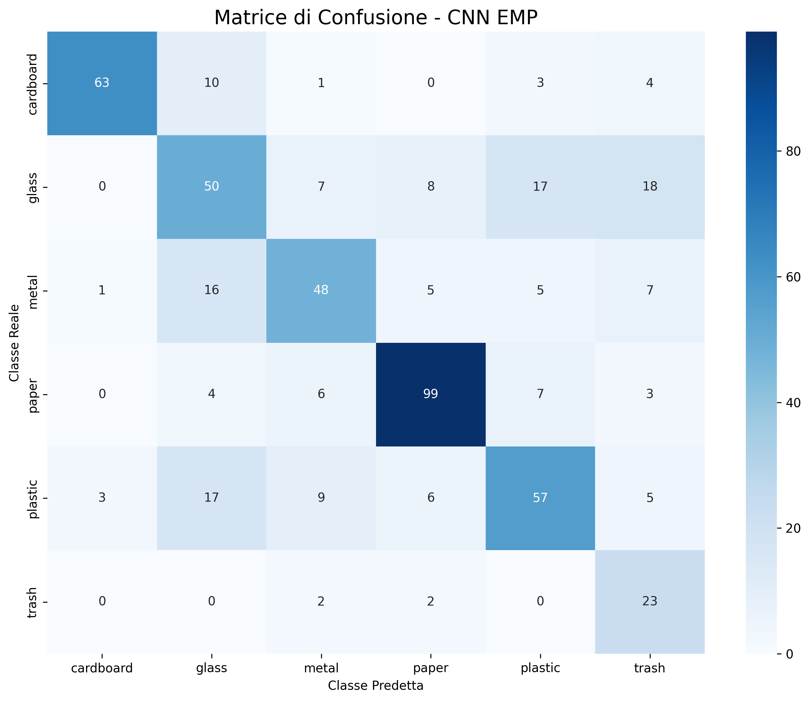

```{r setup, include=FALSE}
knitr::opts_chunk$set(echo = TRUE)
```

# Classificazione della spazzatura usando l'AI

Per il secondo progetto del corso di Programmazione Avanzata ho scelto di affrontare una delle task più classiche quando si deve sviluppare un modello AI from scratch e valutarne le prestazioni: il riconoscimento e la classificazione automatizzata delle immagini.

In particolare, per svolgere questo compito ho scelto il problema della classificazione dei rifiuti, una sfida tecnica cruciale per l'ottimizzazione e l'automazione dei futuri processi di riciclo. Come dataset ho scelto il noto TrashNet, che raccoglie e suddivide le immagini in sei categorie distinte (rimando all'apposito capitolo per un maggiore approfondimento).

## Spiegazione della task

Per portare a termine il compito ho intenzione di suddividere il lavoro in quattro fasi essenziali:

-Analisi e Pre-processing dei Dati: Esplorazione del dataset originale e applicazione di tecniche di Data Augmentation per irrobustire il modello.

-Sviluppo di un Modello Convoluzionale "from scratch": Creazione ed addestramento da zero di una Rete Neurale Convoluzionale (CNN) proprietaria.

-Transfer Learning: Utilizzo di un modello pre-addestrato di livello industriale (ResNet18), riadattando gli ultimi livelli decisionali per la task specifica del progetto.

-Valutazione e Diagnostica Comparativa: Confronto delle performance dei due modelli analizzandone criticità e punti di forza.

## Scelta e preparazione del Dataset

Il successo nell'addestramento di una Rete Neurale Convoluzionale dipende profondamente dalla qualità e dalla formattazione dei dati in ingresso.

Il dataset scelto è composto da immagini suddivise in 6 classi di materiali: cartone (cardboard), vetro (glass), metallo (metal), carta (paper), plastica (plastic) e materiale indifferenziato (trash).

```{r, echo=FALSE, message=FALSE, warning=FALSE}
library(jpeg)

cartella <- "dataset-resized"
classi <- list.dirs(cartella, full.names = FALSE, recursive = FALSE)

par(mfrow = c(2, 3), mar = c(0.5, 0.5, 2, 0.5))

for (cl in classi) {
  file_foto <- list.files(file.path(cartella, cl), full.names = TRUE)[1]
  img <- readJPEG(file_foto)
  plot(1, type = "n", xlim = c(0, 1), ylim = c(0, 1), axes = FALSE, xlab = "", ylab = "", main = cl)
  rasterImage(img, 0, 0, 1, 1)
}
```

Le fotografie sono state scattate in un ambiente controllato, posizionando i singoli oggetti su uno sfondo bianco neutro. Per garantire una buona variabilità e simulare condizioni realistiche, gli oggetti sono stati immortalati in diverse pose, angolazioni e stati di usura (ad esempio, lattine schiacciate o fogli di carta stropicciati).

Tuttavia, l'utilizzo "grezzo" di questo dataset presentava diverse criticità tecniche che avrebbero compromesso l'apprendimento della rete. È stata quindi sviluppato ono script python (data_processing.py) per risolvere i problemi fondamentali.

-Gestione delle dimensioni e del formato

Le immagini originali del dataset TrashNet presentano una forma rettangolare e dimensioni non standardizzate. Poiché le architetture convoluzionali moderne (e in particolare la ResNet18) richiedono in ingresso tensori quadrati di dimensioni fisse, è stato necessario uniformare il formato applicando un ritaglio centrale per rimuovere i bordi superflui e isolare l'oggetto e un ridimensionamento finale per ottenere la risoluzione esatta richiesta dalla rete (224x224).

-Creazione del Train Set e Test Set

Il dataset viene fornito come un'unica grande raccolta di immagini, priva di una suddivisione predefinita tra dati di addestramento e dati di validazione. Per poter valutare oggettivamente le prestazioni del modello su dati "mai visti", è stata implementata una suddivisione rigorosa dell'80% per il training e del 20% per il test. Fondamentale in questa fase è stato l'utilizzo di una suddivisione stratificata (stratify). Questa tecnica garantisce che la proporzione originale di ogni classe venga mantenuta intatta in entrambi i sottoinsiemi, evitando il rischio che classi rare finiscano interamente nel set di addestramento o in quello di test.

-Risoluzione dello sbilanciamento delle classi (Oversampling)

L'ostacolo più critico riscontrato durante l'esplorazione esplorazione dei dati è stato il forte sbilanciamento delle classi (es. molte immagini di carta e cartone, ma pochissime di plastica o trash). Allenare una rete su dati sbilanciati porterebbe il modello a favorire statisticamente la classe maggioritaria, ignorando quelle minoritarie. Invece di eliminare immagini (perdendo informazioni preziose), si è scelto di risolvere il problema dinamicamente durante il training:

È stata calcolata la frequenza di ogni classe nel Train Set.

A ogni immagine è stato assegnato un "peso" matematico inversamente proporzionale alla frequenza della sua classe (classi rare ottengono un peso maggiore).

È stato utilizzato un estrattore bilanciato (WeightedRandomSampler con reinserimento).

Durante l'addestramento, il sistema "pesca" i dati in modo truccato, estraendo più volte le immagini delle classi rare fino a pareggiare numericamente quelle delle classi abbondanti.

-Data Augmentation e Normalizzazione Per evitare che la rete memorizzasse a memoria le immagini ripetute a causa dell'Oversampling (fenomeno di Overfitting), sono state applicate tecniche di Data Augmentation esclusivamente al set di addestramento. Durante il caricamento, le immagini subiscono trasformazioni casuali: capovolgimenti orizzontali (con probabilità del 50%) e rotazioni casuali fino a 15 gradi. In questo modo, la rete vede varianti sempre nuove dello stesso oggetto.

Infine, come ultimo passaggio, i valori dei pixel (originariamente da 0 a 255) sono stati convertiti in tensori (0-1) e normalizzati.

## Implementazione del mio modello convoluzionale

Per comprendere a fondo i meccanismi alla base della computer vision, prima di affidarmi a soluzioni pre-addestrate di livello industriale, ho deciso di progettare e addestrare da zero una Rete Neurale Convoluzionale (CNN) proprietaria. L'obiettivo è stato quello di creare un'architettura bilanciata: sufficientemente profonda per riconoscere i complessi pattern visivi dei rifiuti (come le pieghe del cartone o i riflessi del vetro), ma abbastanza snella da poter essere addestrata in tempi ragionevoli.

Il modello, denominato TrashNetCNN, è stato implementato sfruttando il modulo neurale del framework PyTorch. Di seguito è riportato il codice che ne definisce la struttura e il flusso dei dati.

```{python, eval=FALSE, echo=TRUE, python.reticulate=FALSE}

import torch
import torch.nn as nn
import torch.nn.functional as F

class TrashNetCNN(nn.Module):
    def __init__(self):
        super(TrashNetCNN, self).__init__()
        
        self.conv1 = nn.Conv2d(in_channels=3, out_channels=16, kernel_size=3, padding=1)
        self.pool1 = nn.MaxPool2d(kernel_size=2, stride=2)
        
        self.conv2 = nn.Conv2d(in_channels=16, out_channels=32, kernel_size=3, padding=1)
        self.pool2 = nn.MaxPool2d(kernel_size=2, stride=2)
        
        self.conv3 = nn.Conv2d(in_channels=32, out_channels=64, kernel_size=3, padding=1)
        self.pool3 = nn.MaxPool2d(kernel_size=2, stride=2)

        self.fc1 = nn.Linear(in_features=64 * 28 * 28, out_features=512)
        self.fc2 = nn.Linear(in_features=512, out_features=6)

    def forward(self, x):
        x = self.pool1(F.relu(self.conv1(x)))
        x = self.pool2(F.relu(self.conv2(x)))
        x = self.pool3(F.relu(self.conv3(x)))
        
        x = x.view(-1, 64 * 28 * 28)
        
        x = F.relu(self.fc1(x))
        x = self.fc2(x)
        
        return x

```

Analisi dell'architettura della rete

Il modello segue una struttura classica "alla VGG", divisa in due macro-blocchi operativi: l'estrazione delle feature visive e la classificazione finale:

1. Estrazione delle Feature (Strati Convoluzionali e Pooling)
Questa fase ha il compito di "guardare" l'immagine e individuarne i tratti distintivi. È composta da tre blocchi applicati in sequenza attraverso la funzione forward:

Conv2d: Lo strato convoluzionale applica dei filtri matematici mobili (kernel 3x3) all'immagine. Il primo strato parte dai 3 canali di base (colori RGB) ed estrae 16 mappe di caratteristiche preliminari. Il secondo passa da 16 a 32, e il terzo da 32 a 64, catturando pattern visivi geometricamente sempre più complessi man mano che si scende in profondità.

ReLU: A ogni convoluzione segue la funzione di attivazione ReLU, che introduce la non-linearità azzerando i valori negativi. Questo permette alla rete di apprendere relazioni complesse che vanno oltre le semplici operazioni lineari.

MaxPool2d: Ha il compito di comprimere l'immagine, dimezzandone altezza e larghezza a ogni passaggio, ma trattenendo solo il pixel con il valore massimo (il tratto più distintivo). Partendo da immagini in ingresso di 224x224 pixel, dopo tre operazioni di pooling la risoluzione "spaziale" scende a 28x28 pixel.

2. Appiattimento dei dati (Flattening)
Prima di poter prendere una decisione categorica, i tensori tridimensionali in uscita dall'ultima convoluzione (64 "fogli" grandi 28x28 pixel) devono essere trasformati. Tramite l'istruzione x.view(-1, 64 * 28 * 28), i dati vengono letteralmente srotolati in un unico lungo vettore monodimensionale.

3. Classificazione (Strati Lineari)
Il vettore appiattito entra infine nel "cervello decisionale" della rete (Fully Connected layers):

fc1: Il primo strato lineare riceve gli oltre 50.000 input visivi e li condensa in 512 neuroni decisionali, passando nuovamente per un'attivazione ReLU.

fc2: L'ultimo strato riduce ulteriormente le informazioni a 6 valori numerici esatti, noti come logits. Questi 6 output corrispondono esattamente alle probabilità associate alle 6 categorie di spazzatura previste dal dataset TrashNet.


### Training e analisi dei risultati

```{r, echo=FALSE, warning=FALSE, message=FALSE, fig.width=10, fig.height=5}
d1 <- read.csv("CNN.csv")
```

```{r, echo=FALSE}
paste("Accuratezza massima raggiunta sul Test Set (CNN):", max(d1$Accuracy_Test, na.rm=TRUE), "%")
```


```{r, echo=FALSE, warning=FALSE, message=FALSE, fig.width=10, fig.height=5}
par(mfrow=c(1,2), mar=c(4,4,3,2))
plot(d1$Epoca, d1$Loss_Train, type="l", col="steelblue", lwd=2, xlab="Epoche", ylab="Loss", main="CNN: Andamento Loss", ylim=range(c(d1$Loss_Train, d1$Loss_Test), na.rm=TRUE))
lines(d1$Epoca, d1$Loss_Test, col="firebrick", lwd=2)
legend("topright", c("Train", "Test"), col=c("steelblue", "firebrick"), lty=1, lwd=2, bty="n")
plot(d1$Epoca, d1$Accuracy_Train, type="l", col="steelblue", lwd=2, xlab="Epoche", ylab="Accuratezza (%)", main="CNN: Andamento Accuratezza", ylim=range(c(d1$Accuracy_Train, d1$Accuracy_Test), na.rm=TRUE))
lines(d1$Epoca, d1$Accuracy_Test, col="firebrick", lwd=2)
legend("bottomright", c("Train", "Test"), col=c("steelblue", "firebrick"), lty=1, lwd=2, bty="n")

```

L'analisi dei grafici di addestramento evidenzia in modo marcato il fenomeno dell'Overfitting. Osservando le curve di Accuratezza e Loss, si nota come le performance sul Train Set (linea blu) migliorino costantemente fino alla quindicesima epoca, sfiorando il 95% di accuratezza. Tuttavia, le curve del Test Set (linea rossa) raccontano una dinamica differente: già a partire dall'epoca 4, la Loss smette di scendere e l'accuratezza si stabilizza intorno al 75%. L'ampio "Generalization Gap" che si viene a creare tra le due linee dimostra che, superata una fase iniziale di sano apprendimento, i livelli convoluzionali della rete hanno iniziato a memorizzare le specifiche immagini di addestramento perdendo la capacità di generalizzare su dati mai visti. Questo risultato conferma i fisiologici limiti di un modello addestrato da zero su un dataset di dimensioni modeste.


```{r, echo=FALSE, fig.align='center', out.width='60%'}

```

La matrice di confusione, calcolata sfruttando i pesi del modello al suo picco massimo di accuratezza (e non nell'ultima epoca di overfitting), offre uno spaccato molto interessante sulle difficoltà incontrate dalla rete. Analizzando i falsi positivi e i falsi negativi fuori dalla diagonale principale, è possibile avanzare alcune supposizioni sulle logiche visive apprese dall'architettura:

Vetro e Plastica: Si nota che ben 13 oggetti in vetro sono stati erroneamente classificati come plastica. È verosimile ipotizzare che la rete venga ingannata dalla forte somiglianza visiva tra i due materiali: le trasparenze, i riflessi della luce e le forme cilindriche tipiche delle bottiglie potrebbero generare pattern quasi identici per i filtri convoluzionali.

Metallo e Plastica: Emerge una notevole confusione reciproca tra queste due classi (12 oggetti in metallo scambiati per plastica e 11 in plastica scambiati per metallo). Si può supporre che le texture di contenitori lisci, o i bordi irregolari di lattine e bottiglie schiacciate, mettano in crisi i livelli superficiali della rete, che non dispongono della profondità necessaria per coglierne le differenze materiche.

La classe "Trash": Risulta essere la categoria con la capacità predittiva più bassa in assoluto (solo 19 predizioni corrette). Essendo la classe "indifferenziata", al suo interno raccoglie rifiuti di forme, colori e composizioni completamente eterogenee. È lecito supporre che la totale assenza di un pattern visivo ricorrente renda quasi impossibile, per un modello addestrato da zero, estrarre una regola matematica generale per questa specifica categoria.


## Trainig di un modello già disponibile su pytorch

Per la seconda fase del progetto, ho esplorato le potenzialità del Transfer Learning utilizzando un modello pre-addestrato ampiamente diffuso: la ResNet18. Questa tecnica consiste nel prendere una rete neurale che ha già "studiato" su milioni di immagini generiche e sfruttare la sua ottima memoria visiva per risolvere un problema nuovo.

Poiché la ResNet18 è già capace di riconoscere in autonomia forme, bordi, colori e texture, non è stato necessario ricostruire o addestrare da zero la sua struttura interna. L'unico vero intervento a livello di codice è stato adattare la sua "porta di uscita": ho rimosso l'ultimo strato della rete (originariamente impostato per classificare 1000 oggetti diversi) e l'ho sostituito con un nuovo livello decisionale a 6 uscite, corrispondenti esattamente alle sei categorie di rifiuti del dataset TrashNet. In questo modo, in una breve fase di addestramento, il modello ha semplicemente dovuto imparare ad associare le sue enormi conoscenze pregresse al nostro specifico problema della spazzatura.

### Analisi dei risultati

```{r, echo=FALSE, warning=FALSE, message=FALSE, fig.width=10, fig.height=5}
d2 <- read.csv("resnet.csv")
```

```{r, echo=FALSE}
paste("Accuratezza massima raggiunta sul Test Set (ResNet):", max(d2$Accuracy_Test, na.rm=TRUE), "%")
```

```{r, echo=FALSE, warning=FALSE, message=FALSE, fig.width=10, fig.height=5}
par(mfrow=c(1,2), mar=c(4,4,3,2))
plot(d2$Epoca, d2$Loss_Train, type="l", col="steelblue", lwd=2, xlab="Epoche", ylab="Loss", main="ResNet: Andamento Loss", ylim=range(c(d2$Loss_Train, d2$Loss_Test), na.rm=TRUE))
lines(d2$Epoca, d2$Loss_Test, col="firebrick", lwd=2)
legend("topright", c("Train", "Test"), col=c("steelblue", "firebrick"), lty=1, lwd=2, bty="n")
plot(d2$Epoca, d2$Accuracy_Train, type="l", col="steelblue", lwd=2, xlab="Epoche", ylab="Accuratezza (%)", main="ResNet: Andamento Accuratezza", ylim=range(c(d2$Accuracy_Train, d2$Accuracy_Test), na.rm=TRUE))
lines(d2$Epoca, d2$Accuracy_Test, col="firebrick", lwd=2)
legend("bottomright", c("Train", "Test"), col=c("steelblue", "firebrick"), lty=1, lwd=2, bty="n")

```

L'addestramento della ResNet18 ha evidenziato una curva di apprendimento decisamente rapida ed efficace. La rete è riuscita ad assimilare rapidamente le informazioni dal Train Set (linea blu), portando la Loss quasi a zero e l'Accuratezza vicina al 100% in pochissime epoche.

Guardando il Test Set (linea rossa), si osserva un andamento tipico dei modelli complessi adattati a dataset ridotti: le curve risultano leggermente più "frastagliate" e volatili rispetto a quelle di addestramento. Nonostante queste normali fluttuazioni, il trend complessivo è innegabilmente positivo e l'accuratezza finale sfiora il 90%, dimostrando l'ottima capacità della rete di riconoscere e classificare immagini di spazzatura mai viste prima.

```{r, echo=FALSE, fig.align='center', out.width='60%'}

```

La matrice di confusione della ResNet18 evidenzia una capacità predittiva molto solida, confermata dalla netta concentrazione dei valori lungo la diagonale principale. Andando ad analizzare le misclassificazioni residue, è possibile avanzare alcune deduzioni tecniche su ciò che ancora "inganna" la rete:

Il problema dei riflessi (Plastica, Vetro e Metallo): Gli errori più frequenti si concentrano nella classificazione della plastica, talvolta confusa con il vetro o con il metallo. È altamente probabile che, nonostante la profondità della rete, la presenza di superfici lucide, trasparenze e riflessi luminosi generi delle feature visive sovrapponibili tra questi tre specifici materiali.

Carta e Metallo: Si registrano alcuni episodi in cui la carta viene scambiata per metallo. Questa anomalia potrebbe essere giustificata dalla presenza, nel dataset, di carta plastificata/lucida o di fogli fortemente accartocciati le cui pieghe nette emulano visivamente gli spigoli di una lattina schiacciata.

La classe "Trash": Sebbene i numeri siano proporzionalmente buoni, rimane la categoria con il tasso di errore più distribuito. Anche per un modello pre-addestrato e profondo come la ResNet18, l'estrema eterogeneità visiva dei rifiuti "indifferenziati" rende fisiologicamente complesso isolare dei pattern matematici univoci e universali.


## Confronto tra i due modelli

```{r, echo=FALSE, warning=FALSE, message=FALSE, fig.width=10, fig.height=5}
par(mfrow=c(1,2), mar=c(4,4,3,2))
plot(d1$Epoca, d1$Loss_Test, type="l", col="steelblue", lwd=2, xlab="Epoche", ylab="Loss Test", main="Confronto Loss (Test)", ylim=range(c(d1$Loss_Test, d2$Loss_Test), na.rm=TRUE))
lines(d2$Epoca, d2$Loss_Test, col="firebrick", lwd=2)
legend("topright", c("CNN Custom", "ResNet18"), col=c("steelblue", "firebrick"), lty=1, lwd=2, bty="n")
plot(d1$Epoca, d1$Accuracy_Test, type="l", col="steelblue", lwd=2, xlab="Epoche", ylab="Accuratezza Test (%)", main="Confronto Accuratezza (Test)", ylim=range(c(d1$Accuracy_Test, d2$Accuracy_Test), na.rm=TRUE))
lines(d2$Epoca, d2$Accuracy_Test, col="firebrick", lwd=2)
legend("bottomright", c("CNN Custom", "ResNet18"), col=c("steelblue", "firebrick"), lty=1, lwd=2, bty="n")


```

La CNN Custom deve imparare a riconoscere forme, colori e materiali partendo da zero, avendo a disposizione solo le poche migliaia di foto del nostro dataset. La ResNet18, invece ha già osservato milioni di oggetti nella sua vita; sa perfettamente come si comporta la luce su una superficie o come è fatto uno spigolo, e deve solo imparare ad associare queste sue conoscenze pregresse alle 6 categorie di spazzatura (Transfer Learning).

Guardando i grafici relativi al Test Set, questa differenza di "esperienza visiva" è lampante. La linea rossa della ResNet18 domina nettamente il confronto: l'Accuratezza si posiziona costantemente su livelli superiori, arrivando a sfiorare il 90%, mentre la rete creata da zero fatica a superare la soglia del 75%. Anche la curva della Loss conferma questo divario tecnologico, mostrando come la ResNet18 ottenga previsioni molto più sicure e precise, al contrario della CNN che, mandata in overfitting, si arresta su un "livello di errore" decisamente più alto e piatto.

Questa netta superiorità si riflette anche mettendo a paragone le due matrici di confusione. La CNN proprietaria andava facilmente in crisi di fronte a materiali con texture simili, scambiando frequentemente la plastica con il vetro o con il metallo. La ResNet18, grazie alla sua architettura più profonda, riesce a cogliere differenze materiche molto più sottili, riducendo drasticamente questi falsi positivi. Inoltre, di fronte alla classe "Trash" (la più caotica ed eterogenea), la CNN crollava quasi completamente per l'impossibilità di trovare una regola semplice, mentre la ResNet dimostra di possedere una memoria visiva sufficientemente complessa da riuscire a isolare pattern utili anche nel disordine indifferenziato.


## Miglioramenti al mio modello

```{r, echo=FALSE, warning=FALSE, message=FALSE, fig.width=10, fig.height=5}
d3 <- read.csv("CNN_emp.csv")
```

```{r, echo=FALSE}
paste("Accuratezza massima raggiunta sul Test Set (CNN Migliorata):", max(d3$Accuracy_Test, na.rm=TRUE), "%")
```

```{r, echo=FALSE, warning=FALSE, message=FALSE, fig.width=10, fig.height=5}
par(mfrow=c(1,2), mar=c(4,4,3,2))
plot(d3$Epoca, d3$Loss_Train, type="l", col="steelblue", lwd=2, xlab="Epoche", ylab="Loss", main="CNN Migliorata: Andamento Loss", ylim=range(c(d3$Loss_Train, d3$Loss_Test), na.rm=TRUE))
lines(d3$Epoca, d3$Loss_Test, col="firebrick", lwd=2)
legend("topright", c("Train", "Test"), col=c("steelblue", "firebrick"), lty=1, lwd=2, bty="n")
plot(d3$Epoca, d3$Accuracy_Train, type="l", col="steelblue", lwd=2, xlab="Epoche", ylab="Accuratezza (%)", main="CNN Migliorata: Andamento Accuratezza", ylim=range(c(d3$Accuracy_Train, d3$Accuracy_Test), na.rm=TRUE))
lines(d3$Epoca, d3$Accuracy_Test, col="firebrick", lwd=2)
legend("bottomright", c("Train", "Test"), col=c("steelblue", "firebrick"), lty=1, lwd=2, bty="n")

```

```{r, echo=FALSE, fig.align='center', out.width='60%'}

```
